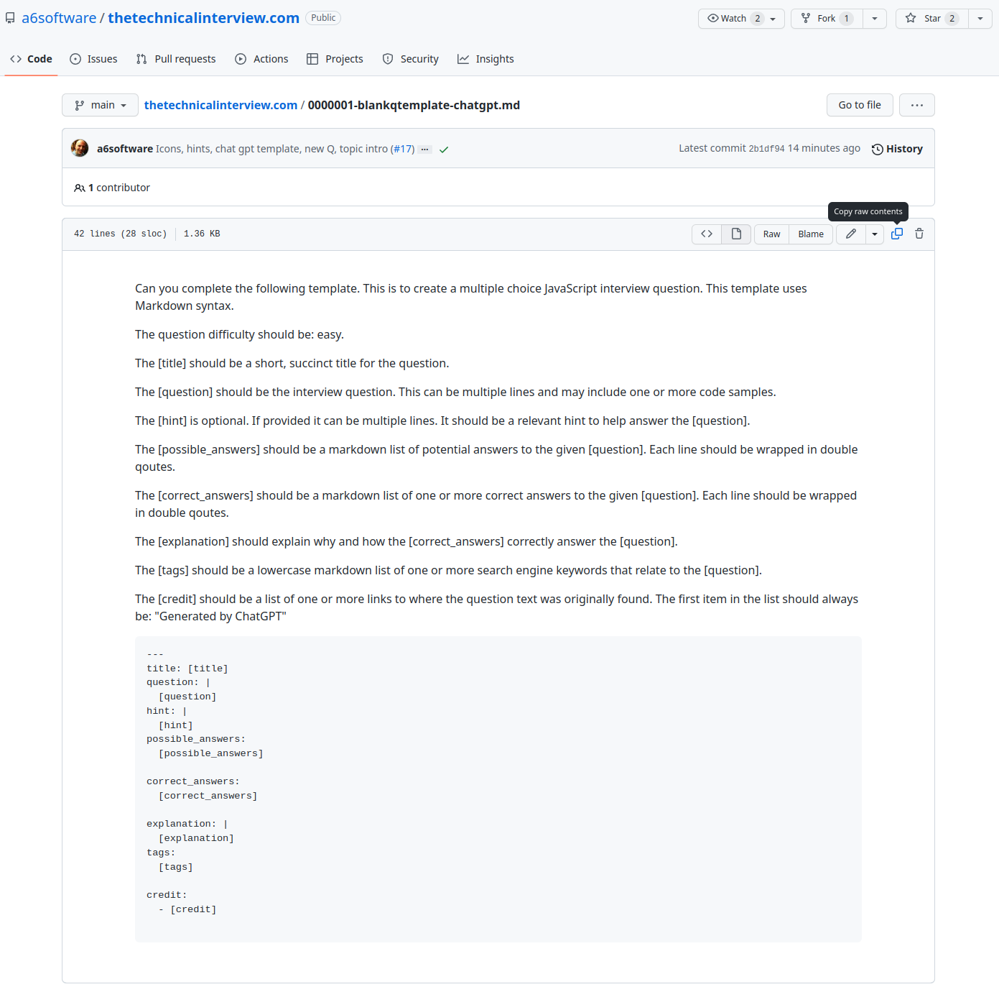

Welcome to the open source code repo for https://thetechnicalinterview.com/

This project is to practice technical questions often found in second stage / technical interviews. 

New questions are very welcome. 

## How To Add A New Question

Questions are created from [YAML files](https://github.com/a6software/thetechnicalinterview.com/tree/main/lib/question), using [GitHub flavoured Markdown](https://github.github.com/gfm/) syntax. 

To add a new question, the simplest way is to copy an existing question, delete all the existing stuff and then add in your own question / answer info instead.

Be sure to [lint the contents of your YAML file](http://www.yamllint.com/).

Then put in a PR. The rest happens by magic / the work experience kid at Vercel.

### How To Create A New Question Using Chat GPT

You can use the provided template to create new questions using Chat GPT.

Copy the contents of the template:



Then paste into Chat GPT, and a new question will be magically created for you.

Follow the remainder of the instructions from above to add your new question to the project.

## Local dev

First, run the development server:

```bash
npm run dev
# or
yarn dev
```

Open [http://localhost:3000](http://localhost:3000) with your browser to see the result.


# ToDo

- [ ] BUG - fix up next & previous, broken
 - [ ] need test for Q submission
 - [x] 'next' when last question in a section should not take you to the next section (e.g. AWS > JS)
 - [x] extract 'next' and 'previous' buttons
- [ ] DRY up radio & checkbox
- - [x] extract breadcrumbs
- [ ] breadcrumbs should be responsive
  - [ ] fix up the overly long breadcrumbs for aws Q's
- [ ] stretch 'submit' button on mobile view
- [ ] add 'edit this question' github link from Q page
- [ ] add 'discuss this question' - link to GitHub Q&A (not sure how that works yet)
- [ ] add icon links in footer
- [ ] extract base layout
  - [ ] extract Head
  - [ ] move footer into appropriate place

## Done

- [x] colourise correct answers after submit 
- [x] breadcrumbs are funked on Q pages
- [x] breadcrumbs needed on topic pages
- [x] pretty sure `question/[...requestedQuestion]` should not be spread
- [x] initial render of Q pages is slow as heck, investigate
- [x] separate AWS / JS questions dynamically
- [x] add github link from main page
- [x] add some form of analytics, ideally not GA - well, it's GA for now. Open to alternatives.
- [x] extract footer

